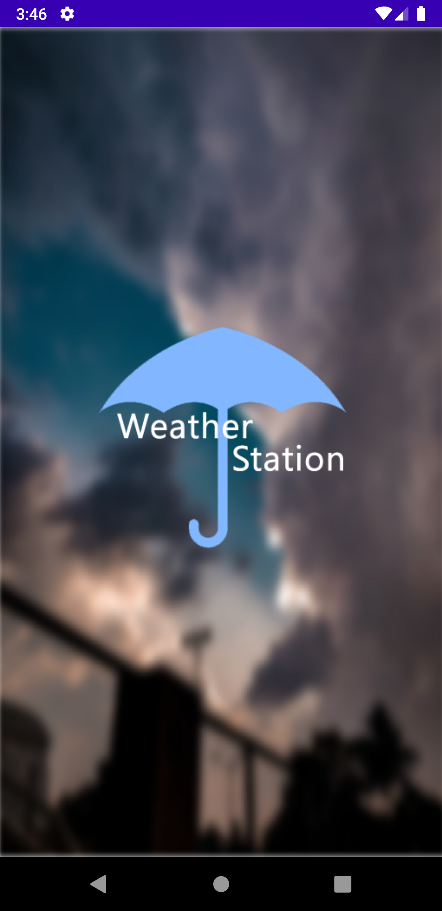
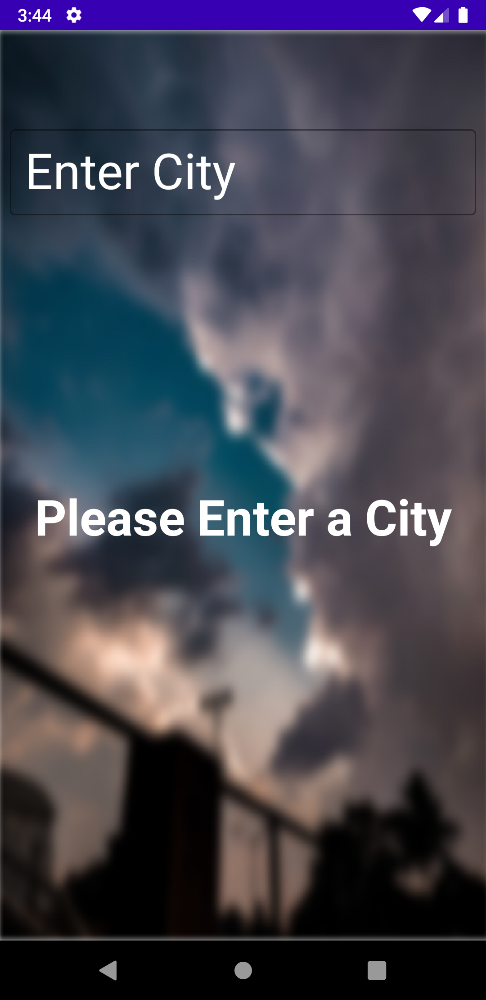
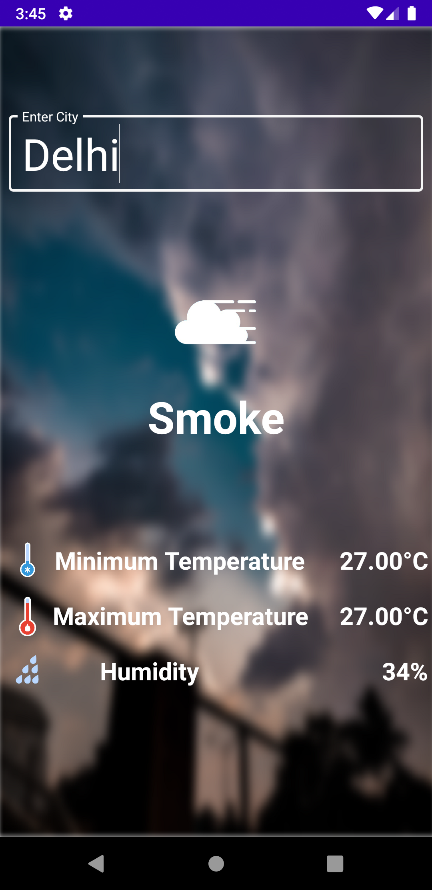
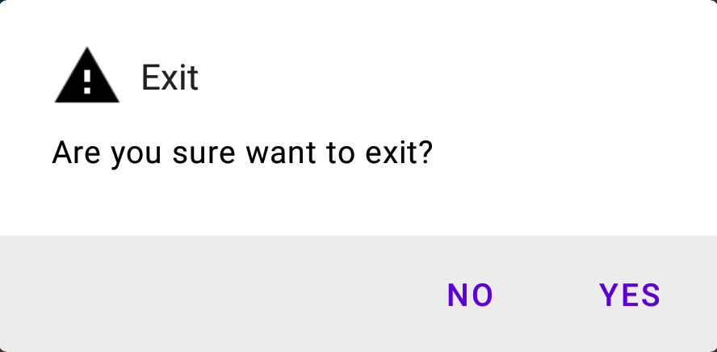

# Weather-Station

Weather Station is a simple app for finding the weather of a city. This app uses open weather api. The app contains :
- The app has a splash screen.
- The app will show **Maximum Temperature**,**Minimum Temperature**, **Humditiy** and **Weather Type** of the entered city.

&nbsp;&nbsp;&nbsp;&nbsp;&nbsp;&nbsp;

## Splash Screen
This is the first screen which will be shown at the start of app.

The app logo will be shown for 1.5-2 seconds and then it brings to Home Screen. Back button is disabled in this screen.

## Home Screen
This is the home screen. It contains
- A edit box where the city name is written.
- On typing a valid city, the data is in 3 parts.
	- The first part is the logo representing weather.
	- The second part is the weather name/type.
	- The thrid part consists of list containing max temperature, min temperature and the humidity.
- If any problem occurs during this process a snackbar is shown at the bottom of screen.

The app may stuck for a second as it is collecting data.

On pressing back button will give a dialogue box asking to exit the app. The dialogue is shown below.

## Further Improvements

The further improvements in this app can be:
- Add more weather data.
- Maybe add a loading screen.

## Download

The min sdk version required is 21,i.e., in other words the minimum android version requried is Lolipop(5.0).

The app can be download from <a href="https://drive.google.com/file/d/1z0sJ6llzUHp3NQaFJb6KfziVAX9-amFJ/view?usp=sharing">here</a>.

<!--stackedit_data:
eyJoaXN0b3J5IjpbMjkwNzQwMjUwLDIxMDY4MzMyMywyNTE3Mj
IyNSwtODk3MTQzMDgyLDc1NjY2Mjg3NywxOTg2NjU0NjY2XX0=

-->